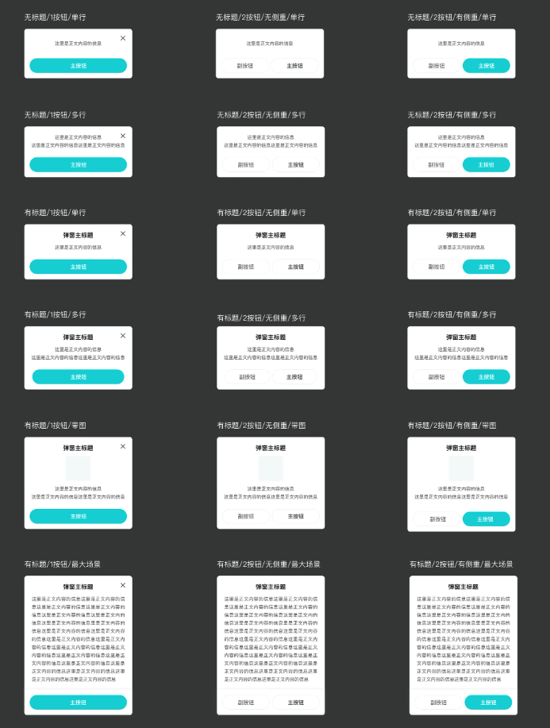

## 通用弹窗

 ### 基础类弹窗

​																						设计稿



#### API

``` kotlin
DefaultNewDialog.Builder()
            .setTitle("title")//设置标题
            .setContent("content")//设置内容
            .setLeftTitle("left")//设置左边按钮内容
            .setRightTitle("right")//设置右边按钮内容
            .setCancelOnTouchOutside(true)//设置窗外点击关闭弹窗
            .setPrimary(true)//设置主色调(右边按钮为主色调效果)
            .setCloseable(true)//设置是否显示右上角关闭按钮
            .clickListener(object : DefaultNewDialog.OnDialogClickListener() {
                //左按钮点击事件
                override fun clickLeft(dialog: DefaultNewDialog) {
                    //配置super可自己控制是否关闭弹窗
									  //super.clickLeft(dialog)
                }

                //有按钮点击事件
                override fun clickRight(dialog: DefaultNewDialog) {
                    super.clickRight(dialog)
                }
            })
            .build(this)
            .show()
```


